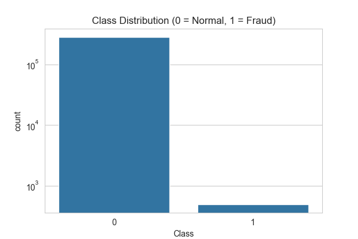

cat > README.md << 'EOF'
# Beyond Accuracy: Credit Card Fraud Detection

A fraud detection project focused on properly handling severe class imbalance — because on this dataset, a model can hit **99.9% accuracy while still missing real fraud**.

## The Problem

Credit card fraud is rare: only 0.17% of transactions in this dataset are fraudulent (492 out of 284,807). This severe imbalance means standard evaluation approaches actively mislead you — a model that predicts "not fraud" for every single transaction would still be 99.83% accurate while catching zero fraud.

This project walks through why that matters and how to fix it.

## Key Findings

| Model | Accuracy | Fraud Recall | Fraud Precision |
|---|---|---|---|
| Baseline (no handling) | 99.95% | 80.0% | 90.0% |
| Class Weighting | 99.95% | 82.7% | 87.1% |
| SMOTE | 99.93% | 85.7% | 77.1% |
| Undersampling | 95.50% | 91.8% | **3.4%** |

**Undersampling is a trap**: it catches the most fraud but 96.6% of its alerts are false alarms — unusable in practice. **Class weighting** gave the best precision/recall balance and was chosen as the final approach.

## Methodology

1. **EDA** — explored class imbalance, transaction amount/time patterns, and feature correlations
2. **Baseline models** — trained Logistic Regression and XGBoost with no imbalance handling to demonstrate the accuracy trap
3. **Imbalance handling comparison** — tested class weighting, SMOTE, and random undersampling
4. **Evaluation** — used precision-recall curves (not ROC/accuracy) to select a threshold aligned with a real tradeoff, since PR curves are more informative than ROC curves on highly imbalanced data
5. **Explainability** — used SHAP to identify which features drive fraud predictions (V14, V10, V12, V17 emerged as top predictors, consistent with the EDA)
6. **Interactive dashboard** — built a Streamlit app for uploading transactions and exploring the threshold tradeoff live

## Tech Stack

Python, pandas, scikit-learn, XGBoost, imbalanced-learn, SHAP, Streamlit

## Project Structure
